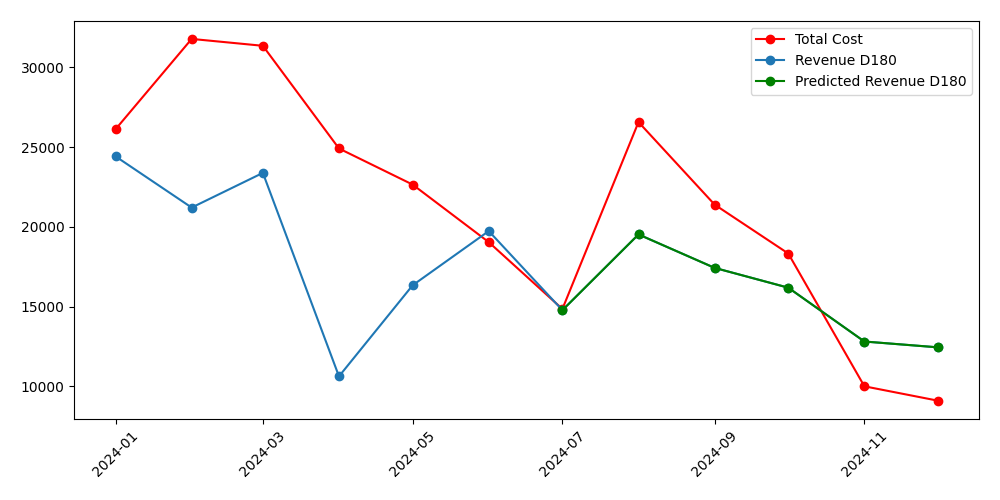

# Task 2
### Using the available data, forecast ROAS D180 for each month

Below is a brief description of the analysis process and the relevant code snippets from [task2.py](/task1.py).

## Data Preparation
- The data is converted into a Pandas DataFrame.
- The Report Month is converted to a datetime object and the DataFrame is sorted chronologically.
- Revenue D180 is computed as the product of Total Installs with ARPU D180.
- The first 6 months are utilized where the data are complete.

## Variable Selection
D180 is utilized for forecasting since it captures the complete revenue cycle over 180 days,
reflecting the true lifetime value of a user. In contrast, shorter-term metrics like D30, D60, or D90
are more volatile and may miss delayed revenue effects. 
Furthermore, D180 smooths out short-term fluctuations, aligning with the long-term ROAS measurement of the task in hand.

Since marketing spend directly influences user acquisition and subsequent revenue generation, Total Cost is used as the predictor variable for forecasting because it is highly correlated with revenue.

## Forecasting Method

1. **Selecting Training Data:**  
   Select the first six completed months as the training set.
   ```python
   X = df[["Total Cost"]].to_numpy()
   Y = df.loc[:6, "Revenue D180"].to_numpy()
   ```
   
2. **Iterative Forecasting:**  
   - Leverages Total Cost as the predictor variable.
   - A linear regression model is trained on the available training subset.
   - Iteratively, the model predicts the revenue for the subsequent month y_pred using the model fitted on a subset of data.
   - The predicted revenue is appended to the target variable array.
    ```python
    for i in range(len(Y), len(X)):
        X_subset = X[:i]
        model.fit(X_subset, Y)
        y_pred = model.predict(X[i].reshape(1, -1))
        Y = np.append(Y, y_pred).reshape(-1, 1)
    ```

3. **ROAS Calculation:**  
   - The forecasted Revenue D180 is stored back in the DataFrame under Predicted Revenue D180.
   - ROAS D180 is computed by dividing the predicted revenue by Total Cost.

```
 Report Month    Total Cost   Total Installs  Actual Revenue D180   Predicted Revenue D180   ROAS D180(%)
    2024-01       $26127.75       11468           $24426.84                $24426.84            93%
    2024-02       $31789.54       13016           $21216.08                $21216.08            67%
    2024-03       $31358.28        6013           $23390.57                $23390.57            75%
    2024-04       $24920.71        3074           $10636.04                $10636.04            43%
    2024-05       $22658.09        3801           $16344.30                $16344.30            72%
    2024-06       $19050.05        3864           $19745.04                $19745.04            104%
    2024-07       $14858.04        3849           $15819.39                $14783.91            99%
    2024-08       $26576.44        4595           $18793.55                $19533.22            73%
    2024-09       $21402.19        3288           $13710.96                $17436.17            81%
    2024-10       $18336.47        2809           $11685.44                $16193.67            88%
    2024-11       $10011.59        1310            $6510.70                $12819.71            128%
    2024-12       $9108.96         2350            $3454.50                $12453.89            137%
```

## Visualization


## Remarks
Generally, a more advanced time-series model with daily data points should be used instead of aggregated monthly data, as this would better capture seasonal effects and changes in the game. Time-series models are well-suited for detecting trends, cycles, and external influences over time. However, a simple linear model with backtesting still provides robust results and effectively captures the overall trend in revenue performance. While it may not fully account for seasonality or game changes, it remains a practical and interpretable approach given the limited size of the dataset.